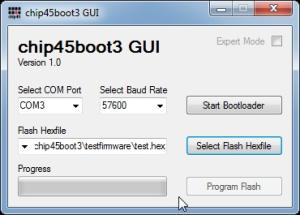
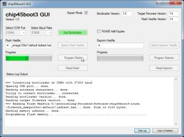

# chip45boot3
AVR ATmega Xmega Bootloader and PC GUI Source Code.

chip45boot3 was previously offered commercially by chip45.com and is now available as open-source under MIT License.

## Description

chip45boot3 is the successor of the popular chip45boot2 bootloader targeting professional applications with extended functionality. It supports almost any Atmel/Microchip AVR ATmega and Xmega microcontrollers. See [infosheet](docs/chip45boot3_Infosheet.pdf) for details.

## Features
chip45boot2 provides the following features:

- faster transmission protocol
- strong 16 bit CRC checksum
- optional 128 bit XTAE encryption of data
- programing and reading of flash and eeprom memory (including verification of programmed content)
- bootloader can read out firmware version from flash and GUI warns, if an older version should be programmed
- communication through USART (e.g. RS232, USB UART converter, optionally RS485)
- support of the internal USB controller of the recent Xmega microcontrollers!
- written in C with Atmel Studio 6.1
- memory footprint highly configurable (e.g. ATmega/USART/just flash programming <2k, full functionality <4k, with USB controller <8k)
- GUI written with Visual C# (2010 Express), full source code included
- separate PC tool for encryption of hex files, full source code included

## Overview

The chip45boot3 bootloader is a highly customizeable bootloader for all ATmega and Xmega devices with bootloader support (i.e. separate bootblock in flash and boot reset vector).

A fast binary protocol with strong 16 bit CRC checksum ensures a reliable communication with a host PC. Flash and EEPROM memory of the target can be written or read out and the written content is verified against the original data.

The bootloader can read out a firmware version from the exisiting flash memory and compare it against the version of the new firmware hexfile. A warning is shown, if an older version should be programmed.

Communication is performed through any UART of the target device with a host PC (e.g. USB UART converter, RS232, RS485). Other microcontroller interfaces can be adopted relatively easy due to the very modular design of
the bootloader.

Application firmware content can be XTAE encrypted optionally making it impossible for attackers to reverse engineer the firmware.

Memory footprint starts at below 2k for small ATmega devices with just flash programming support.

The bootloader is written in C with Atmel Studio 7 and the Windows PC GUI is written with Visual C# Express. Full source code is included of bootloader, PC GUI as well as an PC encryption tool for XTEA encryption of hex files.

## Further Information

- [chip45boot3 Infosheet](docs/chip45boot2_Infosheet.pdf)

## PC Software
The chip45boot3 GUI is a PC/Windows application with a graphical user interface for the bootloader, which simplifies flash and eeprom programming over a COM port.

You can download Windows binaries under [releases](https://github.com/eriklins/chip45boot3/releases).

The PC software was programmed with Visual Studio C#.

## Contributing/Feedback
Feedback / improvements / pull-requests / etc. are welcome. 

However, I decided to open-source the bootloader due to lack of time/resources available for supporting the bootloader anymore, hence I cannot guarantee working on issues/pull-requests in the short-term.

## License
Copyright (C) 2023 Erik Lins

This project is released under the MIT License.
